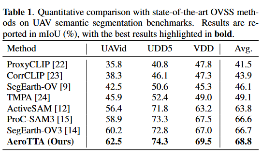
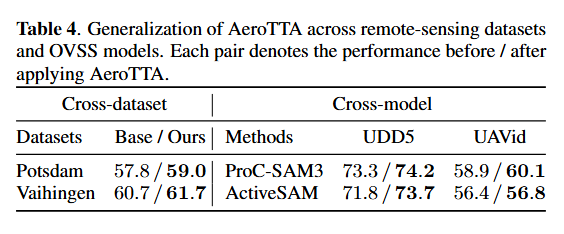
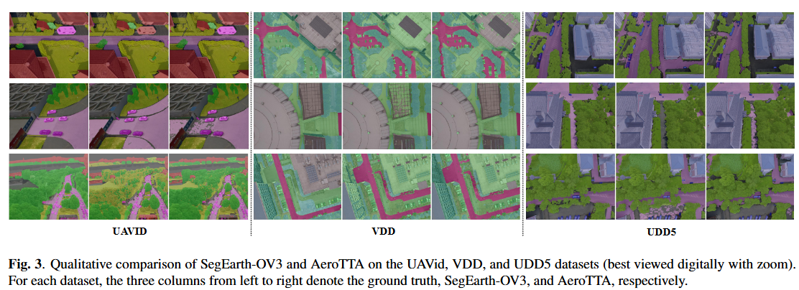

# AeroTTA: Dual-Granularity Low-Rank Test-Time Adaptation for Open-Vocabulary UAV Semantic Segmentation

**Mingzhong Jiang<sup>1</sup>, Shaoyuan Li<sup>1,*</sup>**

<sup>1</sup>Nanjing University of Aeronautics and Astronautics, Nanjing, China<br>
<sup>*</sup>Corresponding author

## Abstract

Open-vocabulary semantic segmentation removes fixed taxonomies, but scale and
viewpoint shifts in low-altitude UAV imagery imbalance spatial evidence and
aggravate category confusion. To address these issues, we propose AeroTTA. It
first performs presence-guided class-aware evidence mining to construct sparse
and conflict-free class-specific spatial evidence, preventing dominant classes
from monopolizing test-time supervision. Building on this evidence, we
introduce dual-granularity collaborative calibration: a local branch constructs
Presence-Tempered Spatial Targets (PTSTs) to suppress overly strong local class
responses, while a global presence branch calibrates image-level
category-presence responses to preserve present classes and suppress absent
ones. Together, they reduce spurious responses in ambiguous regions while
preserving valid category-level evidence. AeroTTA performs lightweight low-rank
adaptation by updating only a small set of LoRA parameters, requiring neither
source data nor target annotations. Experiments demonstrate state-of-the-art
performance on UAV benchmarks, achieving an average mIoU improvement of 2.1%
over the previous best, while demonstrating favorable generalization and
transferability.


## Environment Setup


Create the environment from the provided file:

```bash
conda env create -f environment.yml
conda activate aerotta
```

Install the full MMCV package after PyTorch is available:

```bash
mim install "mmcv==2.1.0"
```

## Checkpoint and Data

### SAM3 Checkpoint

Place the SAM3 checkpoint at:

```text
weight/sam3.pt
```

### Dataset Preparation

Place the five evaluation datasets under `AeroTTA/data`. The released
configurations expect the following minimum directory structure:

```text
AeroTTA/
`-- data/
    |-- potsdam/
    |   |-- img_dir/
    |   |   `-- val/
    |   `-- ann_dir/
    |       `-- val/
    |-- vaihingen/
    |   |-- img_dir/
    |   |   `-- val/
    |   `-- ann_dir/
    |       `-- val/
    |-- UAVid/
    |   |-- img_dir/
    |   |   `-- test/
    |   `-- ann_dir/
    |       `-- test/
    |-- UDD5/
    |   `-- val/
    |       |-- src/
    |       `-- gt/
    `-- VDD/
        `-- test/
            |-- src/
            `-- gt/
```

Potsdam, Vaihingen, and UAVid use `.png` images and `.png` masks. UDD5 and
VDD use `.JPG` images and `.png` masks. Each image and its annotation must
share the same filename stem. If a different directory layout is used, update
`data_root` and `data_prefix` in the corresponding `configs/cfg_*.py` file.

Dataset downloads:

- **ISPRS Potsdam:** [official benchmark](https://www.isprs.org/education/benchmarks/UrbanSemLab/2d-sem-label-potsdam.aspx), [Google Drive](https://drive.google.com/drive/folders/1w3EJuyUGet6_qmLwGAWZ9vw5ogeG0zLz?usp=sharing), or [OpenDataLab](https://opendatalab.com/ISPRS_Potsdam/download). Download `2_Ortho_RGB.zip` and `5_Labels_all_noBoundary.zip`.
- **ISPRS Vaihingen:** [official benchmark](https://www2.isprs.org/commissions/comm2/wg4/benchmark/2d-sem-label-vaihingen/) or [Google Drive](https://drive.google.com/drive/folders/1w3NhvLVA2myVZqOn2pbiDXngNC7NTP_t?usp=sharing). Download `ISPRS_semantic_labeling_Vaihingen.zip` and `ISPRS_semantic_labeling_Vaihingen_ground_truth_eroded_COMPLETE.zip`.
- **UAVid:** [official download page](https://www.uavid.nl/#download).
- **UDD5:** [official repository](https://github.com/MarcWong/UDD).
- **VDD:** [official repository](https://github.com/RussRobin/VDD).

For the Potsdam, Vaihingen, and UAVid conversion/cropping protocol, refer to
the [SegEarth-OV dataset preparation guide](https://github.com/likyoo/SegEarth-OV/blob/main/dataset_prepare.md).


## Model evaluation

The launcher uses one GPU and does not start tmux by default. For example:

```bash
python lora-tta/eval.py tta-configs/cfg_uavid.py 
```

Replace `cfg_uavid.py` with `cfg_udd5.py`, `cfg_vdd.py`, `cfg_potsdam.py`, or
`cfg_vaihingen.py` to evaluate another dataset.

## Results

<p align="center">
  
  <br>
  <em>Main results.</em>
</p>

<p align="center">
  
  <br>
  <em>Extended results.</em>
</p>

## Segmentation Visualization

<p align="center">
  
</p>
